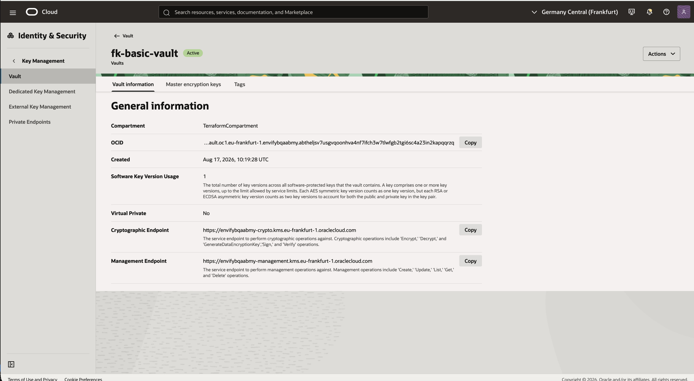
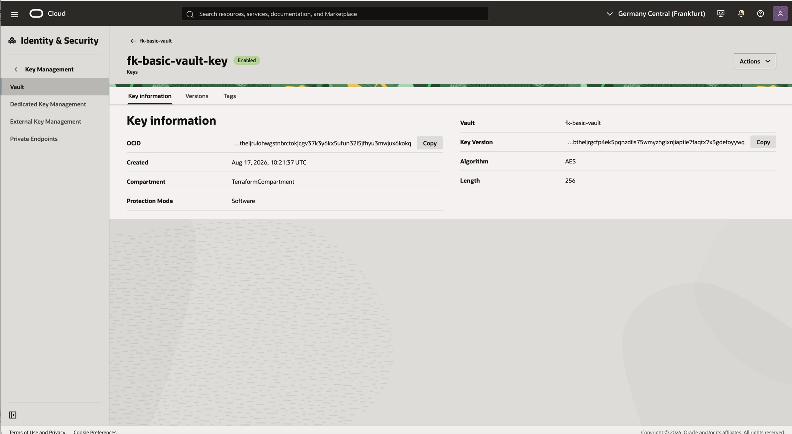
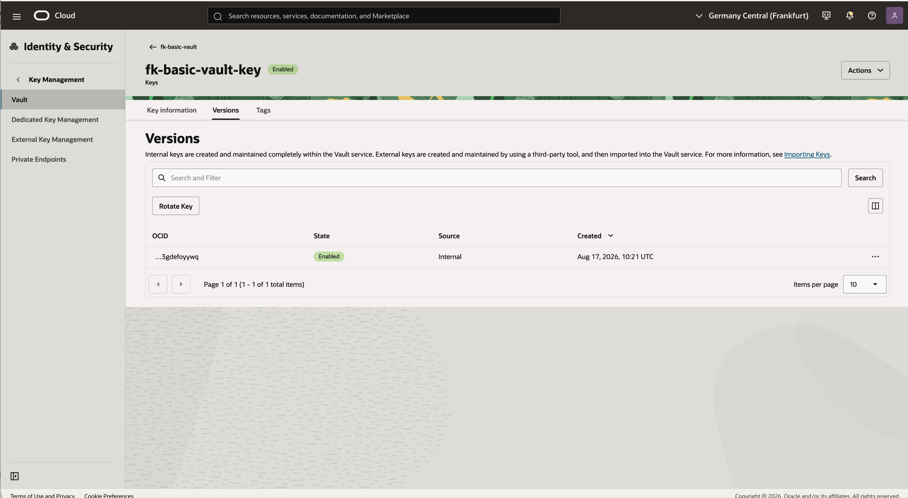

# Example 01: Basic OCI Vault

In this first Vault example, we deploy a **minimal Oracle Cloud Infrastructure (OCI) Vault**
using **Terraform/OpenTofu**.
The module creates a default Vault and a single software-protected symmetric AES KMS key.

This example is intentionally simple and focuses on the **baseline key management path**,
without secrets, workload integration, or IAM policies.

---

## Architecture Overview

This deployment creates:
- One **OCI Vault** using `terraform-oci-fk-vault`
- One software-protected **AES KMS key** in the Vault
- Common freeform tags for lab identification

This is the most direct way to understand the base module behavior before adding
secrets or workloads.

---

## Deployment Steps

Initialize and apply the Terraform/OpenTofu configuration:

```bash
tofu init
tofu plan
tofu apply
```

After a successful deployment, verify the Vault and key directly in the OCI Console.
The console views should show an active default Vault and an enabled software-protected key.

---

## Runtime Notes

After deployment, the Vault should:
- be visible in the selected compartment
- contain one software-protected AES KMS key named `fk-basic-vault-key`
- expose management and crypto endpoints on the Vault details page

No secrets are created in this example. That keeps the baseline focused on
Vault and key lifecycle only.

---

## OCI Console And Runtime Verification

### Vault Status



In the OCI Console, verify that the Vault exists in the selected compartment
and is in an active lifecycle state. This view also confirms that the Vault is
not a Virtual Private Vault.

### Key Status



Open the Vault and verify that the AES KMS key was created successfully.
This view confirms the key algorithm and software protection mode.

### Key Versions



Open the key versions view and verify that the initial key version is enabled.

---

## Cleanup

To remove all resources created by this example:

```bash
tofu destroy
```

---

## Summary

This example demonstrates:
- How to deploy a **basic OCI Vault** using Terraform/OpenTofu
- How to create a software-protected symmetric **AES KMS key**
- How to use the base `terraform-oci-fk-vault` module without extra workload concerns

---

## Learn More

Visit [FoggyKitchen.com](https://foggykitchen.com/) for OCI, multicloud, and Terraform/OpenTofu learning resources.

---

## License

Licensed under the **Universal Permissive License (UPL), Version 1.0**.  
See [LICENSE](../../LICENSE) for more details.

---

© 2026 [FoggyKitchen.com](https://foggykitchen.com) - Cloud. Code. Clarity.
