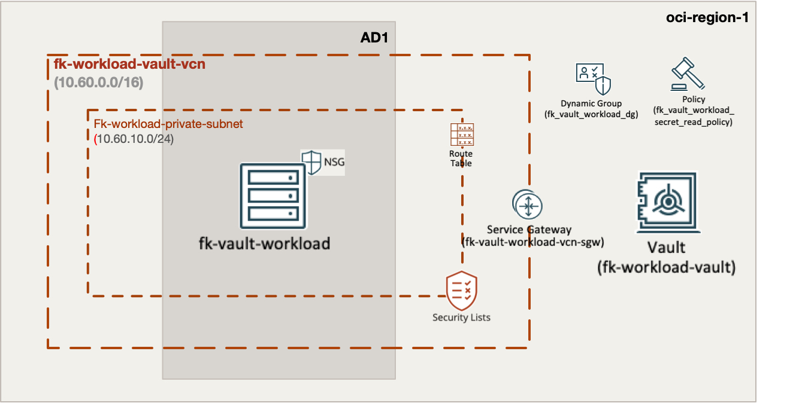
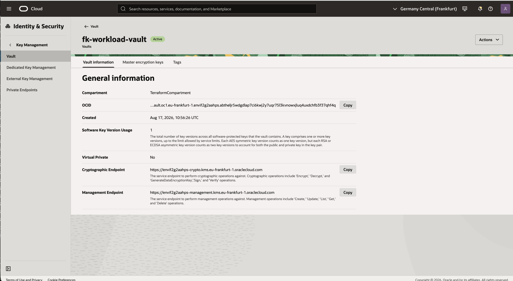
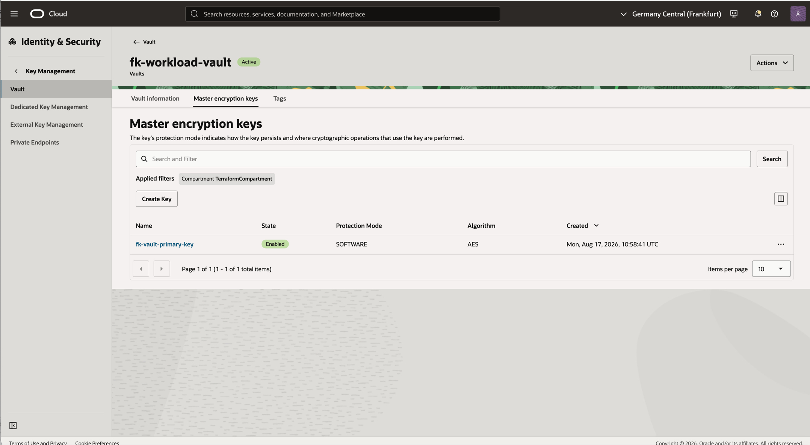
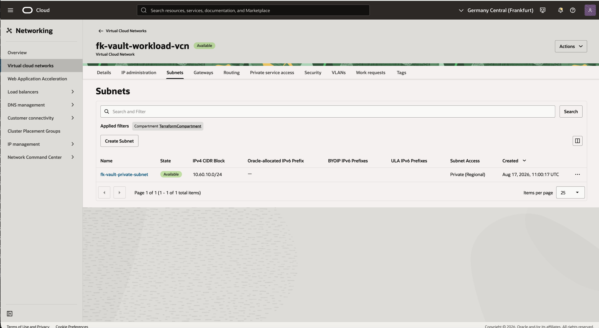
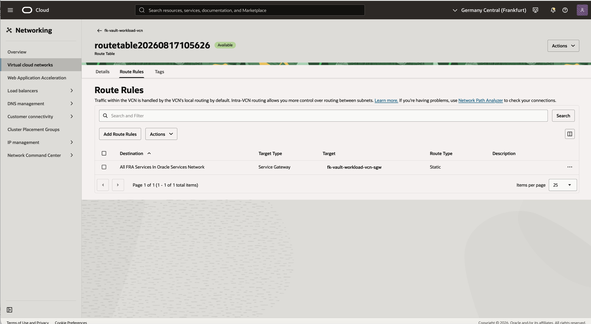
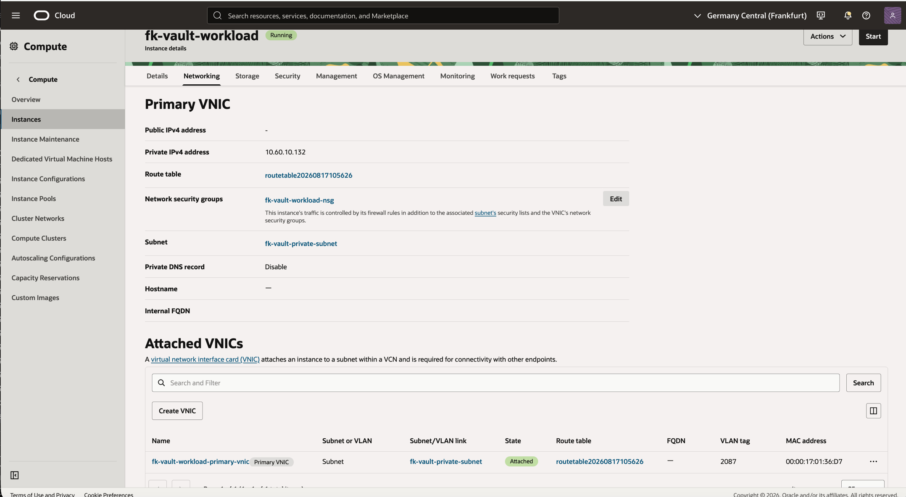
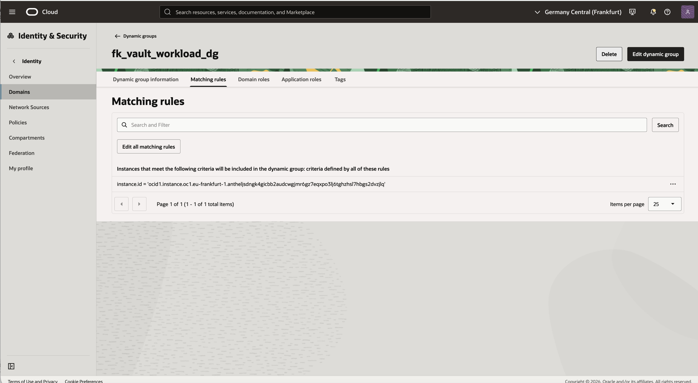
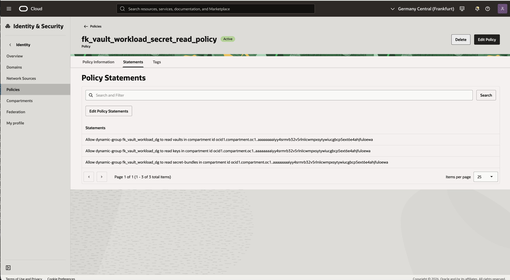

# Example 02: Private OCI Vault Access with Secret and Workload

In this second Vault example, we deploy an **OCI Vault secret** together with
a private workload foundation using **Terraform/OpenTofu**.
The workload is created in a private subnet and receives only the Vault and
secret OCIDs as bootstrap metadata.

This example focuses on the **workload integration path**:
Vault provides the secret boundary, while networking and compute are composed
from dedicated FoggyKitchen modules.

This is the OCI analogue for a private Key Vault access pattern. OCI Vault is
accessed privately from the VCN through a **Service Gateway** to Oracle Services
Network rather than through an Azure-style Private Endpoint.

---

## Architecture Overview



This deployment creates:
- A dedicated **VCN** and private subnet using `terraform-oci-fk-vcn`
- A **Service Gateway** route for private access to OCI services, including Vault
- A workload-scoped **Network Security Group** using `terraform-oci-fk-nsg`
- One private **OCI compute instance** using `terraform-oci-fk-compute`
- One **OCI Vault**, one KMS key, and one Vault secret using `terraform-oci-fk-vault`
- One **OCI Dynamic Group** and IAM policy using `terraform-oci-fk-policy`

The instance does not receive the secret value directly. It receives the
Vault and secret OCIDs as metadata so a real workload can retrieve the secret
at runtime through an approved IAM path such as instance principals.

No Internet Gateway or NAT Gateway is created for this example. The private
subnet routes OCI service traffic through the Service Gateway only.

The Service Gateway provides the private network path to OCI services. It does
not grant data-plane authorization to Vault secrets. This example therefore also
creates an instance-principal IAM path: a dynamic group matching the example
compute instance and a policy allowing that dynamic group to read the required
Vault secret bundle.

---

## Deployment Steps

Initialize and apply the Terraform/OpenTofu configuration:

```bash
tofu init
tofu plan
tofu apply
```

After a successful deployment, OpenTofu will output:
- The Vault OCID
- The created secret OCID
- The compute instance OCID
- The compute instance private IP
- The VCN OCID
- The workload dynamic group OCID
- The workload policy OCIDs

These outputs make it easy to inspect both the Vault layer and the private
workload layer created for this scenario.

---

## Runtime Notes

After deployment, the workload should:
- run in a private subnet without a public IP
- be attached to a workload-specific NSG
- use the Service Gateway path for OCI service access
- have placeholder metadata under `/etc/foggykitchen-vault-demo.env`
- reference the Vault and secret by OCID rather than embedding secret content
- have an instance-principal IAM path that can be used by application code to read the secret bundle

The `demo_secret_value` variable is intended for lab use. For real credentials,
use a protected variable source and a secured remote state backend.

---

## OCI Console And Runtime Verification

### Vault And Secret Status



In the OCI Console, verify that the Vault contains the demo secret
`fk-demo-app-config` and that the secret is encrypted with the module-created key.

### Master Encryption Key Status



Open the Vault's master encryption keys view and verify that
`fk-vault-primary-key` is enabled, software-protected, and uses AES.

### Network View



Verify that the private subnet is created in the VCN and that the compute
instance has no public IP address. Confirm that the private route table targets
the Service Gateway for Oracle Services Network traffic.

### Service Gateway Route



Open the private route table and verify that OCI service traffic is routed to
the Service Gateway. There should be no default route to the internet.

### Compute Private VNIC



Open the compute instance networking view and verify that the primary VNIC has
a private IP address, no public IPv4 address, and the workload NSG attached.

### Workload Metadata

Connect through your approved private access path and inspect
`/etc/foggykitchen-vault-demo.env` to confirm that the workload received
the Vault and secret OCIDs.

### IAM Authorization



In the OCI Console, verify that the dynamic group `fk_vault_workload_dg`
matches the compute instance through an `instance.id` rule. This makes the
private compute instance eligible to use instance principals when retrieving
the secret bundle at runtime.

### IAM Policy



Verify that policy `fk_vault_workload_secret_read_policy` grants the dynamic
group read access to Vault, keys, and secret bundles in the target compartment.
The Service Gateway provides the private network path, while these statements
provide the required OCI IAM authorization.

---

## Cleanup

To remove all resources created by this example:

```bash
tofu destroy
```

---

## Summary

This example demonstrates:
- How to create an **OCI Vault secret** using Terraform/OpenTofu
- How to compose Vault with `terraform-oci-fk-vcn`, `terraform-oci-fk-nsg`, and `terraform-oci-fk-compute`
- How to provide private workload access to OCI Vault through a Service Gateway
- Why private network access and IAM authorization are separate controls
- How to compose instance-principal IAM through `terraform-oci-fk-policy`
- How to keep secret values out of workload bootstrap while still passing secret identifiers
- How to build a private workload foundation for runtime secret retrieval

---

## Learn More

Visit [FoggyKitchen.com](https://foggykitchen.com/) for OCI, multicloud, and Terraform/OpenTofu learning resources.

---

## License

Licensed under the **Universal Permissive License (UPL), Version 1.0**.  
See [LICENSE](../../LICENSE) for more details.

---

© 2026 [FoggyKitchen.com](https://foggykitchen.com) - Cloud. Code. Clarity.
